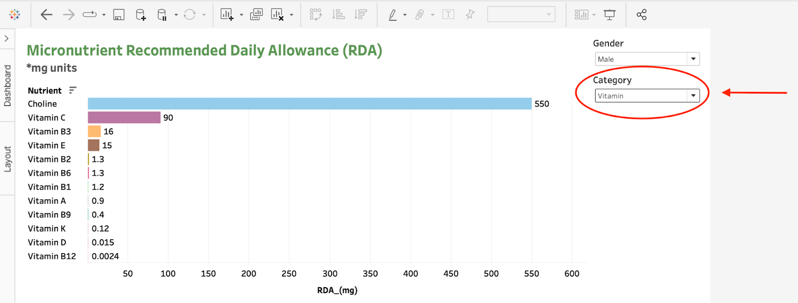
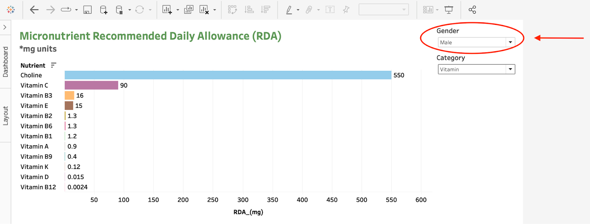
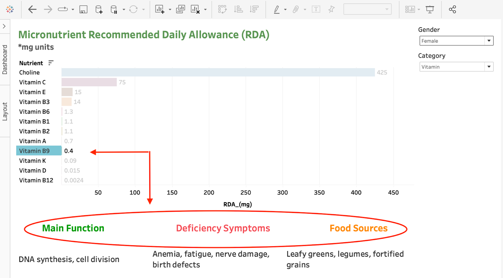
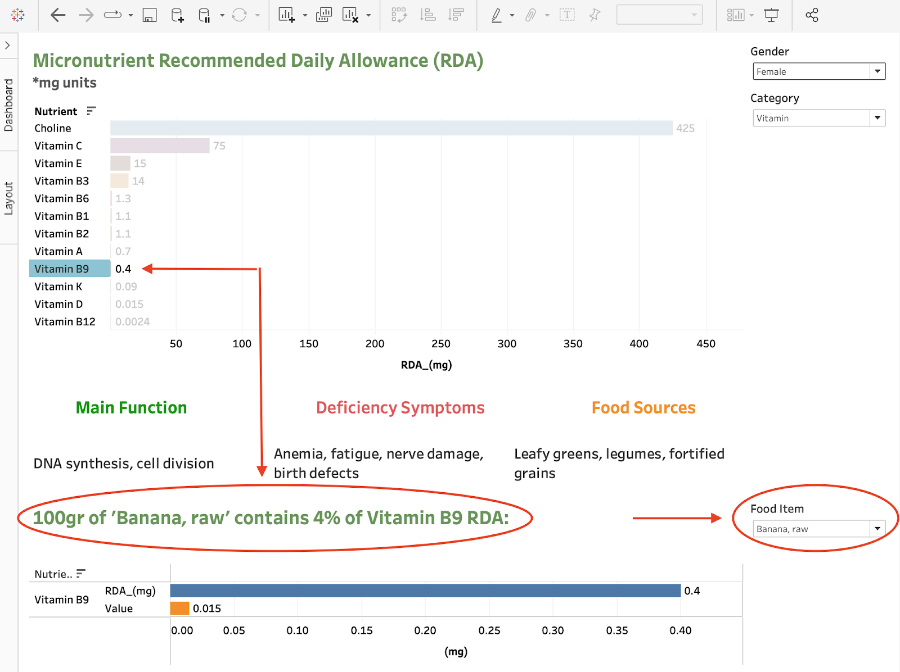

# 🩺 Micronutrients Health Analytics Dashboard
**Public Health Data Visualization | MSc Data Science and Analytics Dissertation (Distinction)**

## 🎯 Project Overview
Interactive dashboard making USDA nutritional data accessible through visualisation, supporting evidence-based dietary decisions and public health research. Designed for both healthcare professionals and the general public seeking reliable nutritional guidance.

## 🎯 Business Applications

- **Healthcare Professionals** - Quick nutritional assessment tool for clinical practice
- **Public Health Policy** - Evidence-based dietary recommendations for population health
- **Education** - Teaching tool for nutritional science and health education programs
- **Personal Health** - Informed dietary decision making for health-conscious individuals

## 🔬 Research Impact
Addresses the critical challenge that **micronutrient deficiencies affect over 40% of adults worldwide**, yet public understanding remains limited. This project bridges complex nutritional science with practical dietary guidance.

## ✨ Key Features

### Interactive Filtering System

- **Interactive Bar Charts** - Compare nutrient values across foods
- **Gender-Specific Filters** - Male/Female RDA recommendations tailored to user selection
- **Micronutrient Categories** - Toggle between vitamins and minerals
- **Real-time Updates** - All visualizations update dynamically based on selections

### Comprehensive Micronutrient Information

When clicking on any micronutrient, users access evidence-based information including:
- **Main Functions** - Physiological roles in the body based on nutritional science
- **Deficiency Symptoms** - Health impacts of insufficient intake from medical literature
- **Food Sources** - Rich dietary sources validated against USDA data

### Advanced Food Analysis

- **Food Item Comparisons** - Search and compare nutritional profiles from 5,624+ USDA items
- **Nutrient content per 100g** serving analysis with scientific accuracy
- **RDA percentage calculations** for evidence-based dietary planning

## 🔗 Explore the Dashboard

**📊 [View Interactive Presentation →](https://gamma.app/docs/Micronutrient-Explorer-Interactive-Nutritional-Tableau-Dashboard-bjfsham896ne3dm)**  
*Complete academic walkthrough of features, methodology, and research applications*

**🚀 [Launch Live Dashboard →](https://public.tableau.com/app/profile/rachel.berger2819/viz/MicronutrientAnalysis/MicronutrientsDashboard?publish=yes)**  
*Explore 20+ micronutrients with gender-specific RDAs, food source recommendations and %RDA in a selection of food items*

## 🛠️ Technical Implementation

- **Data Source:** USDA FNDDS 2019-2020 (5,624 food items)
- **Data Processing:** Python (Pandas, NumPy) for data cleaning and RDA calculations
- **Visualization Platform:** Interactive Tableau Public dashboard
- **Advanced Features:** Gender-specific filtering, real-time updates, comprehensive search
- **Research Scope:** 20 key micronutrients with evidence-based health information

## 📊 Data Source & Methodology
Built on the **USDA Food and Nutrient Database for Dietary Studies 2019-2020 (FNDDS)**, an application database designed to convert food and beverage portions reported in What We Eat in America, National Health and Nutrition Examination Survey into gram amounts and to determine their nutrient values.

**Dataset Specifications:**
- **5,624 food items** with complete nutritional profiles
- **20 key micronutrients** with gender-specific RDA values
- **Official USDA data** ensuring accuracy and reliability
- **Comprehensive coverage** of common dietary foods across demographics

*See [documentation](./docs/) for complete USDA methodology and data specifications.*

## 🔬 Research Methodology

Comprehensive analysis combining quantitative nutritional data with qualitative health information, transforming complex USDA datasets into accessible, actionable insights for diverse stakeholders in public health and nutritional science.

**Keywords:** Micronutrients, Data Visualisation, Nutritional Science, Public Health, Interactive Dashboard

